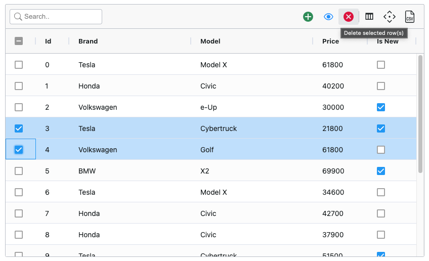

# @extension-packages/ag-grid-angular

[Documented with Storybook](https://extension-packages.github.io/ag-grid-angular/)

## Ag Grid Extension

Expands ag-grid with a toolbar, search and actions.



### Prerequisites

- [Ag Grid Angular](https://www.ag-grid.com/angular-data-grid/getting-started/)
- [Material Icons font](https://fonts.google.com/icons?icon.set=Material+Icons&icon.style=Outlined)
  - [Setup font](https://developers.google.com/fonts/docs/material_icons#icon_font_for_the_web): add in `index.html` or similar

```html
<html>
  <head>
    <link href="https://fonts.googleapis.com/icon?family=Material+Icons+Outlined" rel="stylesheet" />
  </head>
</html>
```

### Features:

- Quick search
- Toolbar actions
- Content projections
  - Multi-slot
    - toolbarLeft => Toolbar left
    - toolbarCenter => Toolbar center
    - toolbarRight => Toolbar right
    - actionsLeft => pre actions
    - actionsRight => post actions
  - Single-slot
- Adapts to ag-grid themes

### Usage Overview

```ts
@Component({
  standalone: true,
  selector: "app-demo-grid",
  imports: [AgGridExtensionModule],
  template: `
    <ag-grid-extension class="ag-theme-balham" [actions]="actions">
      <ag-grid-angular [gridOptions]="gridOptions"></ag-grid-angular>
    </ag-grid-extension>
  `,
})
export class DemoGridComponent {
  actions: AgGridToolbarAction[];
  gridOptions: GridOptions;
}
```
